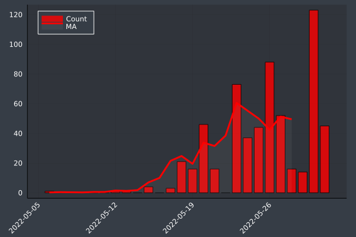
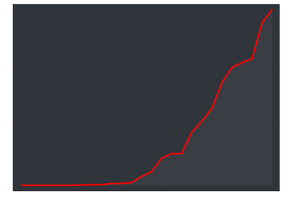

# MonkeyPox

This project aims to provide a time series updated every hour about the 2022 Monkey Pox outbreak.

- For now only global time series is available. 
- For now only confirmed cases are selected to build the time series monkeypox_time_serie.csv.
- The original data is retrievedfrom [this repository](https://github.com/globaldothealth/monkeypox).
- "monkeypox_data.csv" is a csv file representing raw data of Global.health
- Some graphs and some animations are generated from the time series

## New Cases

<!-- -->

## Total Cases

<!-- -->

##

Feel free to use it in any way you want but please, please push for a world without this virus and without any of the other deadly diseases. 

### "Living with the virus" is not a fatality it's a lethal choice made for us.