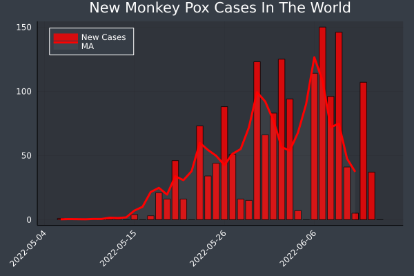

# MonkeyPox

This project aims to provide a time series updated every hour about the 2022 Monkey Pox outbreak.

- You can find [global time series](https://github.com/ZakariaBouguira/MonkeyPox/blob/master/data/global/monkeypox_time_series_World.csv) as well as [specific time series for each country](https://github.com/ZakariaBouguira/MonkeyPox/blob/master/data/by_country)
- For now only confirmed cases are selected to build the time series [monkeypox_time_serie.csv](https://github.com/ZakariaBouguira/MonkeyPox/blob/master/monkeypox_time_series.csv).
- The original data is retrieved from [this repository](https://github.com/globaldothealth/monkeypox).
- [monkeypox_data.csv](https://github.com/ZakariaBouguira/MonkeyPox/blob/master/data/monkeypox_data.csv) is a csv file representing raw data of Global.health
- Some graphs and some animations are automatically generated from the time series

## New Cases

<!-- -->

## Total Cases

<!-- -->

##

Feel free to use it in any way you want but please, 
please push for a world without this virus and without any of the other deadly diseases. 

### "Living with the virus" is not a fatality. It's a lethal choice made for us!